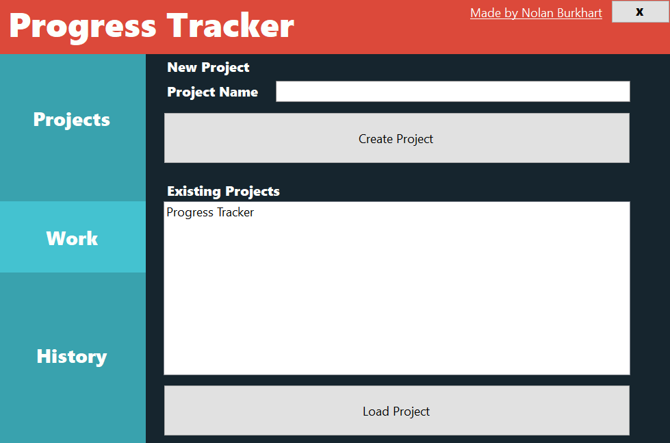
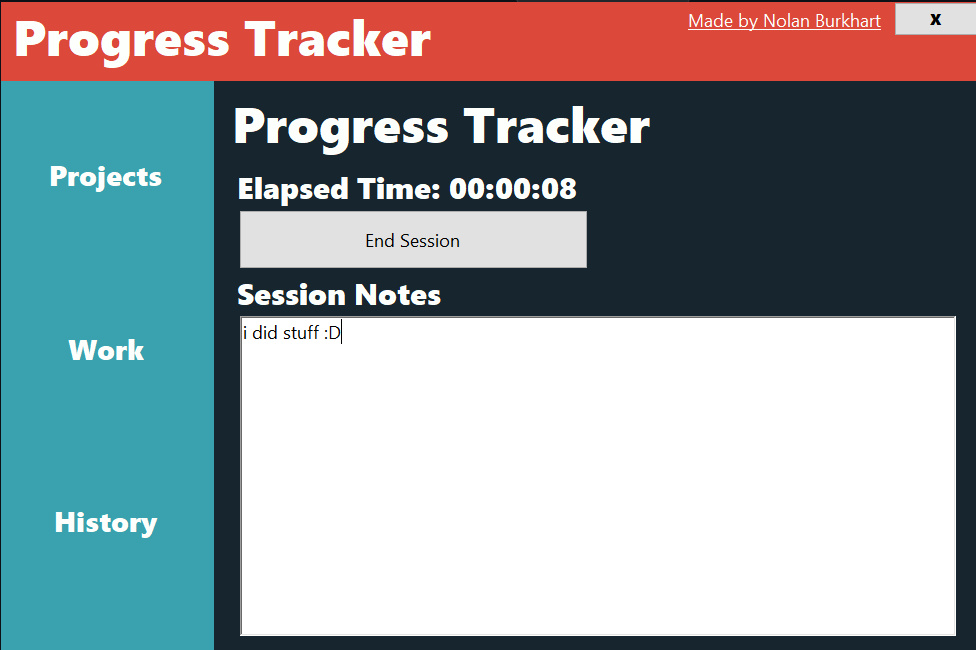
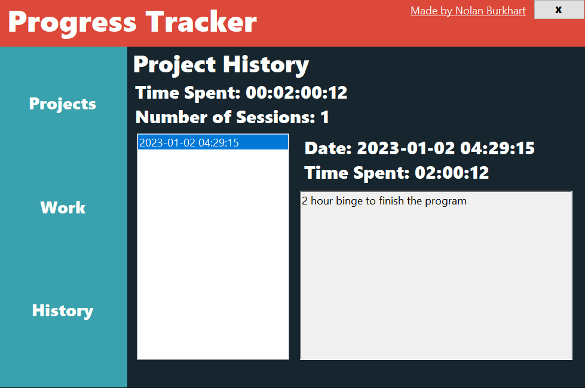

# Progress-Tracker

Have you ever wanted to track how much time you are spending on a project?

Have you ever wanted to realize that you are spending hours to accomplish very little sometimes?

Have you ever wanted to reflect on progress on a day-by-day basis along with time (without using Github)?

Hopefully not, but if you are like me and want to this program is for you.

Not a very sophisticated program, but a useful one (and it will work without internet!)

.NET 6.0 required.

